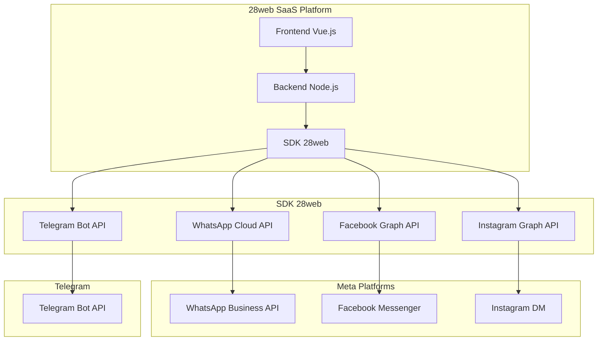

# Plano de Implementação: WhatsApp Cloud API + SDK 28web

## 🎯 Objetivo

Migrar da solução atual (whatsapp-web.js + notificamehubsdk) para uma arquitetura 100% oficial com **WhatsApp Cloud API direto** e **SDK 28web próprio** para máximo controle e estabilidade.

## 📊 Análise da Situação Atual

### Problemas Identificados
- ❌ **whatsapp-web.js**: Não oficial, risco de bloqueio
- ❌ **notificamehubsdk**: Dependência externa, sem controle
- ⚠️ **Wavoip**: Terceiro, sem garantias
- ✅ **Facebook/Instagram**: Já usam Graph API oficial
- ✅ **Telegram**: Já usa Bot API oficial

### Oportunidades
- 🚀 **Controle total** com SDK próprio
- 🔒 **Conformidade** 100% com termos do WhatsApp
- 💰 **Redução de custos** (sem intermediários)
- 🎯 **Performance** otimizada para nosso uso

## 🏗️ Arquitetura Proposta



## 📋 Plano Detalhado

### Fase 1: Pesquisa e Planejamento (1-2 semanas)

#### 1.1 WhatsApp Cloud API Research
- [ ] Requisitos para WhatsApp Business Account
- [ ] Limites de rate limiting
- [ ] Custos e preços por mensagem
- [ ] Processo de verificação de negócio
- [ ] Templates de mensagem (HSM)
- [ ] Webhooks e eventos disponíveis

#### 1.2 Análise do notificamehubsdk
- [ ] Estudar estrutura atual
- [ ] Identificar funcionalidades críticas
- [ ] Mapear endpoints e métodos
- [ ] Analisar tratamento de erros
- [ ] Documentar dependências

#### 1.3 Design do SDK 28web
- [ ] Definir arquitetura modular
- [ ] Interface unificada para todos os canais
- [ ] Sistema de autenticação
- [ ] Estrutura de erros e exceções
- [ ] Sistema de logging e monitoramento

### Fase 2: Configuração WhatsApp (1 semana)

#### 2.1 Business Setup
- [ ] Criar/verificar WhatsApp Business Account
- [ ] Configurar número de telefone comercial
- [ ] Verificar negócio no Meta Business Suite
- [ ] Obter acesso à Cloud API

#### 2.2 Technical Setup
- [ ] Gerar Access Token permanente
- [ ] Configurar webhook URL
- [ ] Configurar número de telefone
- [ ] Testar envio de primeira mensagem

### Fase 3: Desenvolvimento SDK 28web (3-4 semanas)

#### 3.1 Estrutura Base
```typescript
// Estrutura proposta
interface Hub28webClient {
  // Autenticação
  authenticate(token: string): void
  
  // Canais
  whatsapp: WhatsAppChannel
  facebook: FacebookChannel
  instagram: InstagramChannel
  telegram: TelegramChannel
  
  // Utilitários
  setWebhook(url: string): Promise<void>
  getChannels(): Promise<Channel[]>
}
```

#### 3.2 Módulo WhatsApp Cloud API
- [ ] Cliente HTTP para WhatsApp API
- [ ] Envio de mensagens de texto
- [ ] Envio de mídias (imagens, vídeos, documentos)
- [ ] Templates de mensagem (HSM)
- [ ] Tratamento de webhooks
- [ ] Gerenciamento de contatos

#### 3.3 Migração Facebook/Instagram
- [ ] Adaptar código existente para novo SDK
- [ ] Manter compatibilidade com Graph API
- [ ] Otimizar performance
- [ ] Unificar tratamento de erros

#### 3.4 Migração Telegram
- [ ] Migrar do telegraf para SDK 28web
- [ ] Manter todas as funcionalidades
- [ ] Implementar comandos e callbacks

### Fase 4: Integração e Substituição (2 semanas)

#### 4.1 Substituição do notificamehubsdk
- [ ] Remover dependência do package.json
- [ ] Atualizar todos os imports
- [ ] Adaptar controllers e services
- [ ] Atualizar variáveis de ambiente

#### 4.2 Webhooks WhatsApp
- [ ] Implementar endpoint para webhooks
- [ ] Processar eventos de mensagem
- [ ] Tratar atualizações de status
- [ ] Implementar segurança (verificação de assinatura)

### Fase 5: Testes e Validação (2 semanas)

#### 5.1 Testes Unitários
- [ ] Testar cada canal individualmente
- [ ] Testar envio e recebimento
- [ ] Testar tratamento de erros
- [ ] Testar webhooks

#### 5.2 Testes de Integração
- [ ] Testar fluxo completo SaaS
- [ ] Testar multi-tenant
- [ ] Testar concorrência
- [ ] Testar performance

#### 5.3 Testes de Carga
- [ ] Simular alto volume de mensagens
- [ ] Testar rate limiting
- [ ] Testar estabilidade do sistema
- [ ] Monitorar uso de recursos

### Fase 6: Documentação e Deploy (1 semana)

#### 6.1 Documentação Técnica
- [ ] API reference do SDK 28web
- [ ] Guia de migração
- [ ] Manual de configuração
- [ ] Troubleshooting guide

#### 6.2 Deploy em Produção
- [ ] Configurar variáveis de ambiente
- [ ] Deploy gradual (canary)
- [ ] Monitoramento intensivo
- [ ] Rollback plan

## 🔧 Detalhes Técnicos

### Estrutura de Arquivos Proposta
```
backend/src/services/Hub28web/
├── index.ts                 # Export principal
├── Hub28webClient.ts       # Cliente principal
├── channels/
│   ├── BaseChannel.ts      # Canal base abstrato
│   ├── WhatsAppChannel.ts  # WhatsApp Cloud API
│   ├── FacebookChannel.ts  # Facebook Graph API
│   ├── InstagramChannel.ts # Instagram Graph API
│   └── TelegramChannel.ts  # Telegram Bot API
├── types/
│   ├── Message.ts          # Tipos de mensagem
│   ├── Channel.ts          # Tipos de canal
│   └── Webhook.ts          # Tipos de webhook
├── utils/
│   ├── HttpClient.ts       # Cliente HTTP genérico
│   ├── Logger.ts           # Sistema de logging
│   └── ErrorHandler.ts     # Tratamento de erros
└── config/
    └── constants.ts        # Constantes e configurações
```

### Configurações Necessárias
```bash
# .env
# WhatsApp Cloud API
WHATSAPP_PHONE_NUMBER_ID=seu_phone_id
WHATSAPP_ACCESS_TOKEN=seu_access_token
WHATSAPP_WEBHOOK_VERIFY_TOKEN=seu_verify_token
WHATSAPP_VERSION=v18.0

# SDK 28web
HUB28WEB_API_BASE_URL=https://api.28web.io
HUB28WEB_TIMEOUT=30000
HUB28WEB_RETRY_ATTEMPTS=3
```

## 💰 Análise de Custos

### WhatsApp Cloud API
- **Conversões iniciadas pelo negócio**: ~R$ 0,06 por mensagem
- **Conversões iniciadas pelo usuário**: Grátis (primeiro 1000/dia)
- **Mensagens de template**: ~R$ 0,06 por mensagem
- **Webhooks**: Grátis

### Economia vs Soluções Atuais
- ❌ **360dialog**: R$ 0,08-0,12 por mensagem + taxa mensal
- ❌ **Twilio**: R$ 0,10-0,15 por mensagem + taxa mensal
- ✅ **Direto Meta**: R$ 0,06 por mensagem, sem taxa mensal

**Economia estimada**: 20-50% nos custos de WhatsApp

## ⚠️ Riscos e Mitigações

### Riscos Identificados
1. **Complexidade técnica** - SDK próprio exige mais desenvolvimento
2. **Tempo de implementação** - 8-10 semanas total
3. **Riscos de migração** - Possível downtime durante transição
4. **Limitações da API** - WhatsApp tem regras estritas

### Mitigações
1. **Desenvolvimento incremental** - Migrar canal por canal
2. **Testes extensivos** - Ambiente de staging completo
3. **Rollback plan** - Manter sistema atual como backup
4. **Documentação detalhada** - Facilitar manutenção futura

## 📈 Benefícios Esperados

### Imediatos
- ✅ 100% conformidade com termos do WhatsApp
- ✅ Redução de 20-50% nos custos
- ✅ Controle total sobre as integrações
- ✅ Eliminação de dependências externas

### Longo Prazo
- 🚀 Possibilidade de monetizar o SDK 28web
- 🎯 Performance otimizada para nosso uso
- 🔧 Flexibilidade para adicionar novos canais
- 📊 Melhor monitoramento e analytics

## 🚀 Próximos Passos

1. **Aprovação do plano** - Revisão e ajustes finais
2. **Início Fase 1** - Pesquisa e planejamento detalhado
3. **Setup de ambiente** - Preparar WhatsApp Business Account
4. **Desenvolvimento** - Iniciar implementação do SDK 28web
5. **Migração gradual** - Substituir canal por canal

---

**Timeline estimada**: 8-10 semanas
**Investimento necessário**: 320-400 horas de desenvolvimento
**ROI esperado**: 6-12 meses através de economia de custos