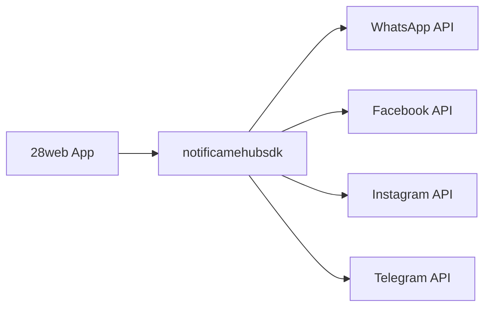
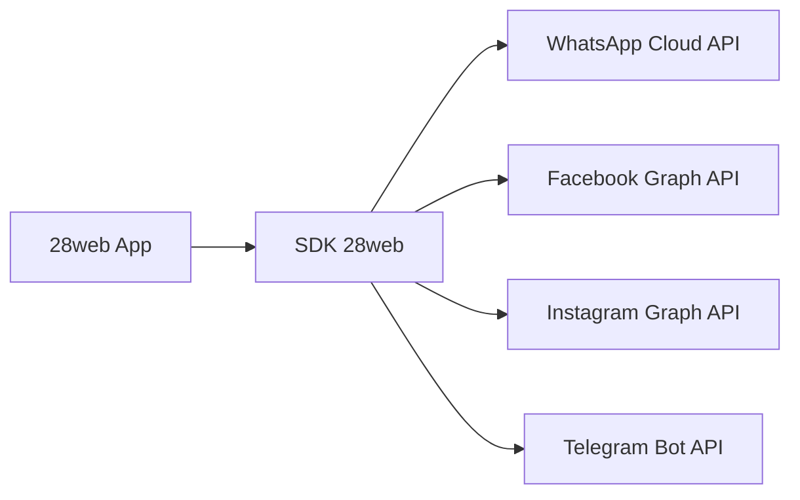

# Resumo Executivo: SDK Hub 28web

## 🎯 O que é um SDK Hub?

Um **SDK Hub** (Software Development Kit Hub) é uma camada de abstração que unifica a comunicação com múltiplas plataformas de mensagens em uma única interface. Pense nele como um "tradutor universal" para APIs diferentes.

## 📊 Como Funciona o SDK Hub Atual (NotificaMe)



**Problemas do modelo atual:**
- 🔒 Dependência externa (notificamehubsdk)
- 💰 Custo adicional por mensagem
- 🚫 Sem controle sobre atualizações
- ⚠️ Risco de descontinuação

## 🚀 Proposta: SDK 28web Próprio



**Vantagens do nosso SDK:**
- ✅ Controle total sobre o código
- 💰 Economia de 20-50% nos custos
- 🔧 Customização para nossas necessidades
- 🚀 Performance otimizada
- 📊 Analytics e monitoramento integrados

## 🏗️ Arquitetura do SDK 28web

### Estrutura Modular
```typescript
// Interface unificada
interface Hub28webClient {
  // Canais disponíveis
  whatsapp: WhatsAppChannel
  facebook: FacebookChannel
  instagram: InstagramChannel
  telegram: TelegramChannel
  
  // Métodos unificados
  sendMessage(channel: string, to: string, content: MessageContent): Promise<Message>
  sendMedia(channel: string, to: string, media: MediaContent): Promise<Message>
  setWebhook(url: string): Promise<void>
  getChannels(): Promise<Channel[]>
}

// Exemplo de uso
const hub28web = new Hub28webClient(process.env.HUB28WEB_TOKEN);

// Enviar mensagem por qualquer canal
await hub28web.sendMessage('whatsapp', '5511999998888', 'Olá! Como posso ajudar?');
await hub28web.sendMessage('facebook', 'user_123', 'Olá! Como posso ajudar?');
await hub28web.sendMessage('instagram', 'user_456', 'Olá! Como posso ajudar?');
```

### Benefícios Técnicos

#### 1. **Abstração Unificada**
- Mesma interface para todos os canais
- Tratamento de erros padronizado
- Formato de mensagens consistente

#### 2. **Flexibilidade**
- Fácil adicionar novos canais
- Customização por canal quando necessário
- Configurações centralizadas

#### 3. **Performance**
- Conexões otimizadas
- Cache inteligente
- Retry automático com backoff

#### 4. **Monitoramento**
- Logging estruturado
- Métricas por canal
- Alertas de falhas

## 💡 Comparativo: NotificaMe vs 28web

| Característica | NotificaMe Hub | SDK 28web |
|---------------|----------------|-----------|
| **Custo por mensagem** | R$ 0,08-0,12 | R$ 0,06 (WhatsApp) |
| **Taxa mensal** | Sim | Não |
| **Controle do código** | Não | Total |
| **Customização** | Limitada | Ilimitada |
| **Suporte** | Terceiro | Próprio |
| **Atualizações** | Externas | Controladas |
| **Monitoramento** | Básico | Avançado |

## 🎯 Casos de Uso

### 1. **Envio de Mensagens**
```typescript
// Texto simples
await hub28web.sendMessage('whatsapp', '5511999998888', {
  type: 'text',
  body: 'Olá! Seu pedido foi confirmado.'
});

// Mídia
await hub28web.sendMedia('whatsapp', '5511999998888', {
  type: 'image',
  url: 'https://exemplo.com/imagem.jpg',
  caption: 'Seu produto'
});

// Template (WhatsApp)
await hub28web.sendMessage('whatsapp', '5511999998888', {
  type: 'template',
  templateName: 'confirmacao_pedido',
  templateData: ['12345', 'João']
});
```

### 2. **Webhooks**
```typescript
// Receber mensagens de qualquer canal
app.post('/webhook/:channel', (req, res) => {
  const { channel } = req.params;
  const message = hub28web.parseWebhook(channel, req.body);
  
  // Processar mensagem
  console.log(`Nova mensagem de ${channel}:`, message);
});
```

### 3. **Multi-tenant**
```typescript
// Configuração por empresa
const client1 = new Hub28webClient(token_empresa1);
const client2 = new Hub28webClient(token_empresa2);

// Isolamento total
await client1.sendMessage('whatsapp', '5511999998888', 'Mensagem Empresa 1');
await client2.sendMessage('whatsapp', '5511999998888', 'Mensagem Empresa 2');
```

## 📈 Impacto no Negócio

### Economia Imediata
- **Redução de custos**: 20-50% em mensagens de WhatsApp
- **Eliminação de taxas**: Sem mensalidade fixa
- **Escalabilidade**: Custo linear com crescimento

### Vantagens Competitivas
- **Propriedade intelectual**: SDK próprio é um ativo
- **Diferenciação**: Controle total sobre funcionalidades
- **Agilidade**: Desenvolvimento rápido de novos recursos

### Oportunidades Futuras
- **Monetização**: Vender SDK 28web para outras empresas
- **White label**: Oferecer como serviço para clientes
- **Marketplace**: Criar ecossistema de plugins

## 🛠️ Implementação

### Fases
1. **Pesquisa** (1 semana): Estudar APIs existentes
2. **Design** (1 semana): Definir arquitetura
3. **Desenvolvimento** (4 semanas): Implementar SDK
4. **Migração** (2 semanas): Substituir notificamehubsdk
5. **Testes** (2 semanas): Validação completa

### Recursos Necessários
- **Desenvolvedores**: 1-2 devs full-stack
- **Tempo**: 8-10 semanas
- **Investimento**: 320-400 horas
- **ROI**: 6-12 meses

## 🎯 Conclusão

O **SDK 28web** representa uma evolução estratégica que vai além da simples substituição tecnológica. É um investimento em:

1. **Autonomia tecnológica** - Fim de dependências externas
2. **Eficiência operacional** - Redução significativa de custos
3. **Vantagem competitiva** - Controle total e diferenciação
4. **Futuro escalável** - Base para novas integrações

A migração para o SDK 28web posiciona a 28web como líder tecnológico no mercado de comunicação multicanal, com controle total sobre sua infraestrutura e capacidade de inovação contínua.